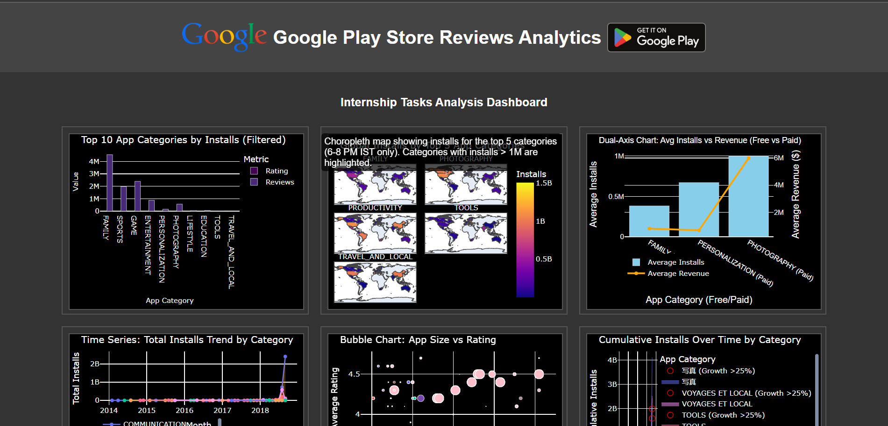

# Google Play Store Analytics Dashboard

A dynamic web application that provides analytics and insights from Google Play Store data. This project includes data visualization, sentiment analysis, and interactive dashboards to help understand app trends and user reviews.

## Features

- Real-time data visualization using Plotly
- Sentiment analysis of user reviews using NLTK VADER
- Interactive dashboard with multiple visualization tasks
- Auto-refresh functionality (updates every minute)
- Region-based analysis with global EV data integration
- Rating and installation trends analysis

## Dataset

The project uses the following datasets:
- `Play Store Data.csv` - Main app data from Google Play Store
- `User Reviews.csv` - User reviews and ratings
- `Global EV Data 2024.csv` - Regional data for analysis

## Technology Stack

- **Backend**: Python, Flask
- **Data Analysis**: Pandas, NumPy, Scikit-learn
- **Visualization**: Plotly
- **NLP**: NLTK (VADER sentiment analysis)
- **Web Server**: Gunicorn (Production)

## Installation

1. Clone the repository:
   ```bash
   git clone https://github.com/sanjaysarveshcj/Google_Play_Store_Analytics.git
   cd Google_Play_Store_Analytics
   ```

2. Create and activate a virtual environment:
   ```bash
   python -m venv venv
   .\venv\Scripts\activate  # Windows
   source venv/bin/activate  # Linux/Mac
   ```

3. Install required packages:
   ```bash
   pip install -r requirements.txt
   ```

4. Download NLTK data:
   ```python
   python -c "import nltk; nltk.download('vader_lexicon')"
   ```

## Usage

1. Run the Flask application:
   ```bash
   python app.py
   ```

2. Open your browser and navigate to:
   ```
   http://localhost:5000
   ```

The dashboard will automatically refresh every minute to show the latest analysis.

## Project Structure

```
├── app.py                     # Flask application main file
├── Tasks_Analysis.py         # Data analysis and visualization logic
├── requirements.txt          # Project dependencies
├── static/                   # Static files (Task HTML files)
│   ├── Task1.html
│   ├── Task2.html
│   └── ...
├── templates/               # Flask templates
│   └── dashboard.html      # Main dashboard template
└── data/                   # Dataset files
    ├── Play Store Data.csv
    ├── User Reviews.csv
    └── Global EV Data 2024.csv
```

## Deployment

This project is configured for deployment on Render:

1. Environment: Python
2. Build Command: `pip install -r requirements.txt && python -c "import nltk; nltk.download('vader_lexicon')"`
3. Start Command: `gunicorn app:app -c gunicorn_config.py`

## Features in Detail

1. **Task 1**: Analysis of top-rated apps with specific filtering criteria (Rating ≥ 4.0, Size ≥ 10MB)
2. **Task 2**: Regional distribution analysis of app installations
3. **Task 3**: Time-based analysis of app updates and trends
4. **Task 4**: Sentiment analysis of user reviews
5. **Task 5**: Category-wise performance metrics
6. **Task 6**: Installation and rating correlation analysis

## Project Dashboard

Here is a screenshot of the dashboard:




## Contributing

1. Fork the repository
2. Create your feature branch (`git checkout -b feature/AmazingFeature`)
3. Commit your changes (`git commit -m 'Add some AmazingFeature'`)
4. Push to the branch (`git push origin feature/AmazingFeature`)
5. Open a Pull Request


## Acknowledgments

- Google Play Store dataset contributors
- NLTK team for VADER sentiment analysis
- Plotly team for visualization libraries